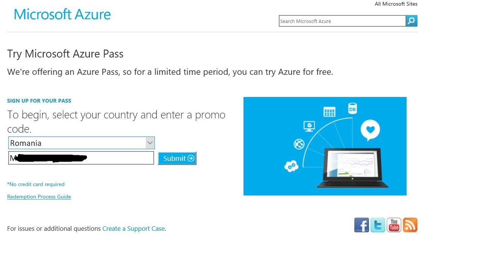
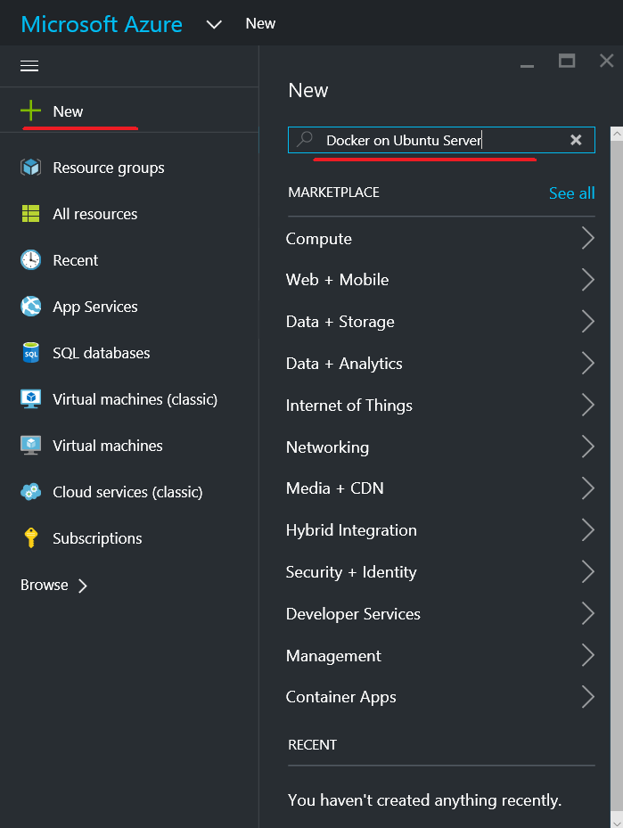
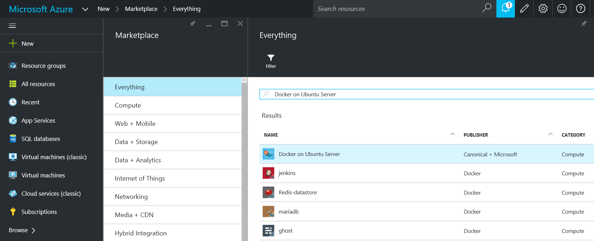
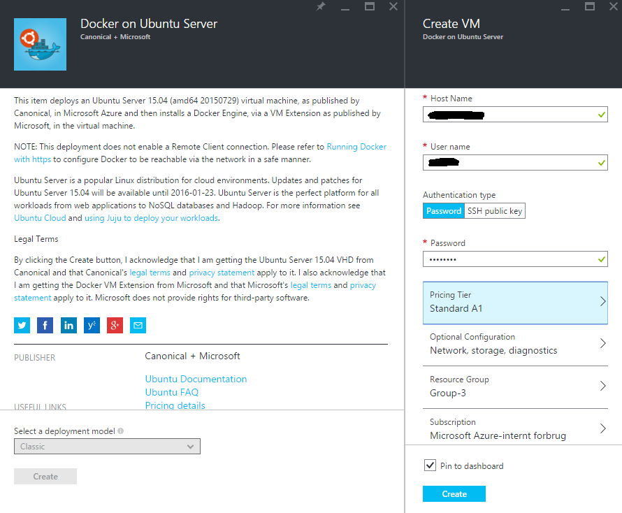
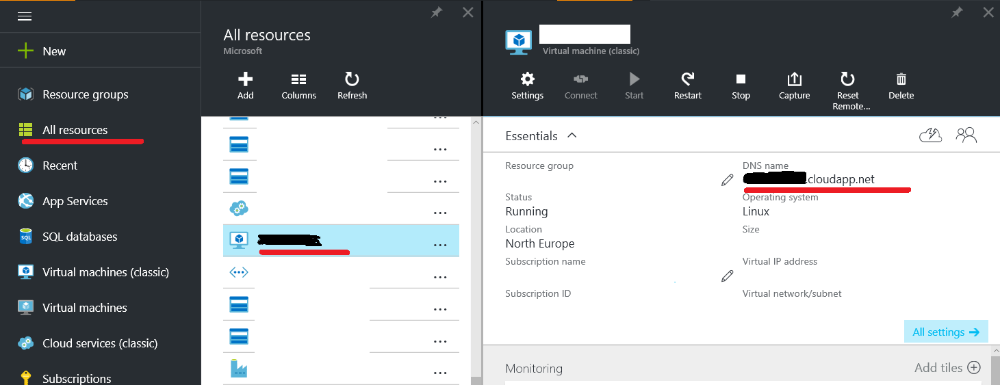
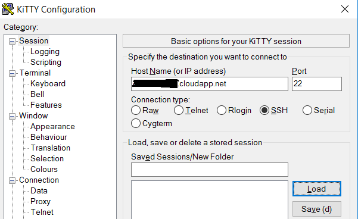
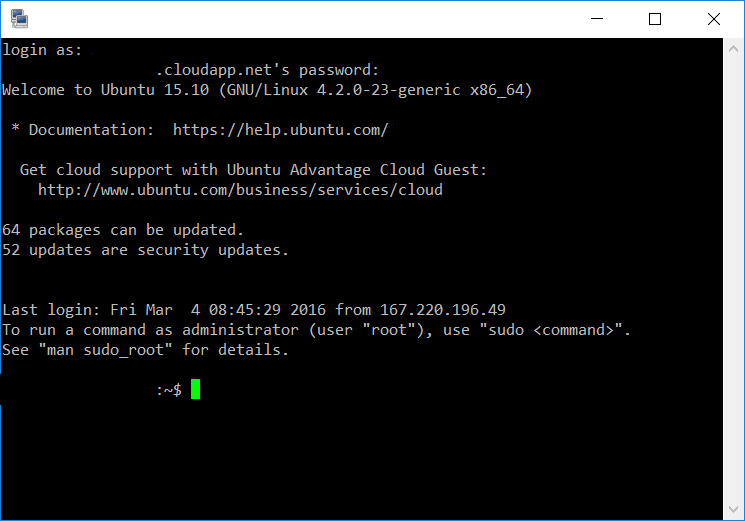

[Back to Menu](../README.md)

#Setup - Create a Free Azure Subscription and set up Ubuntu Docker Host

In order to create a free Azure Subscription, you can either use a Microsoft Azure Pass - provided you have got a code - or create a free trial.

## 1a. Use a Microsoft Azure Pass

By using a [Microsoft Azure Pass](http://www.microsoftazurepass.com/) code, you can create a free trial subscription without the need of a credit card.

You need the following:

* A Microsoft account - [click here](https://www.microsoft.com/en-us/account/) to get one for free

* A Microsoft Azure Pass code

Once you have those, follow the steps below to get your subscription. The [Azure Pass Howto](https://www.microsoftazurepass.com/howto) is available if you need more information.

1. Navigate to [http://www.microsoftazurepass.com/](http://www.microsoftazurepass.com/).

2. Select your country of residence and enter the code.

3. Hit **Submit**. 

4. On the next screen, click **Sign In** and log in with your Microsoft Account, if you weren't already logged in.

5. Fill in the form and click **Activate** to activate your Azure Pass.

## 1b. Get a Microsoft Trial subscription

Alternatively, you can get a $200 trial subscription for Microsoft Azure, to use in order to test any services currently available in the Microsoft cloud. 

Navigate to the [Azure portal](https://azure.microsoft.com/en-us/free/) and follow the instructions in order to obtain a free Azure trial.

## 2. Setup Docker Host

There are multiple ways of provisioning a Linux-based Docker host.

1. Install a [Linux OS on a virtual machine and install Docker](http://docs.docker.com/engine/installation/ubuntulinux/)
2. Use a [pre-existing Linux image from Azure and install Docker](https://azure.microsoft.com/en-us/documentation/articles/virtual-machines-docker-with-portal/)
3. Spin-up an already existing Docker image from the Azure Marketplace

For this lab we will use option 3 - the Ubuntu + Docker image from the Azure Marketplace.

1. Login to the [Azure portal](https://portal.azure.com)
2. Create a new Marketplace image 

	
 
3. Search for 'Docker' and select 'Docker on Ubuntu Server'
 
	
 
4. Fill in the VM information. 
    * The Host Name must be unique, and will determine the DNS name of the Virtual Machine.
    * The User name and Password will be used to access the machine via SSH.
    * For Pricing Tier, select **Standard A1**. 

 
	

5. Hit **Create** and wait for the Virtual Machine to be provisioned. This usually takes 1-2 minutes to complete.

    >NOTE: The Docker VM image automatically opens for port 22, so it can be accessed via SSH. 

6. To find the automatically assigned DNS name of the VM you just created, navigate to the Settings page of the machine in the Azure Portal, and check for **DNS name**. This is the DNS name you can use for the machine address.

	

    >NOTE: You could also use the *Virtual IP address* (also called *VIP*) which is found in the same tab. However, keep in mind that the machine will get a new VIP if it is deallocated by the user at any time. However, the DNS name will be reconfigured to point to the new VIP, therefore you can still use it.

7. Now it's time to connect to the VM. Open your favourite SSH client - on Windows it can be [**PuTTY**](http://www.putty.org/) or [**KiTTY**](http://www.9bis.net/kitty/).

    

    

[Back to Menu](../README.md)